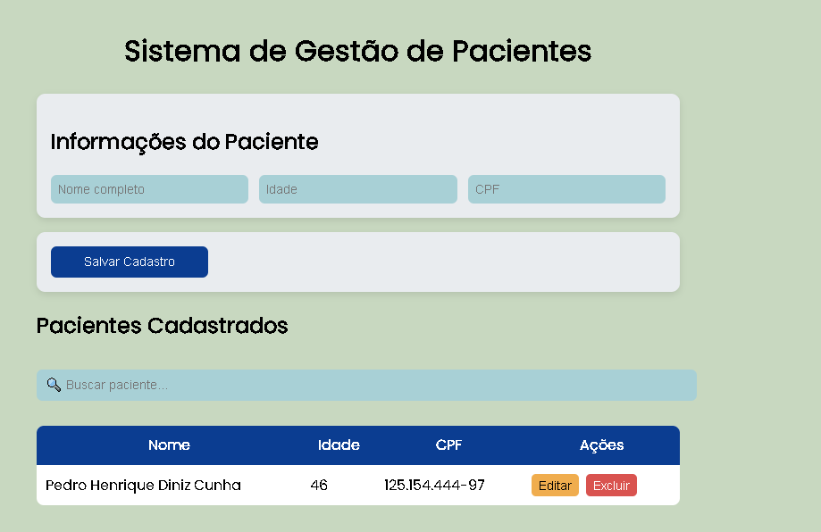
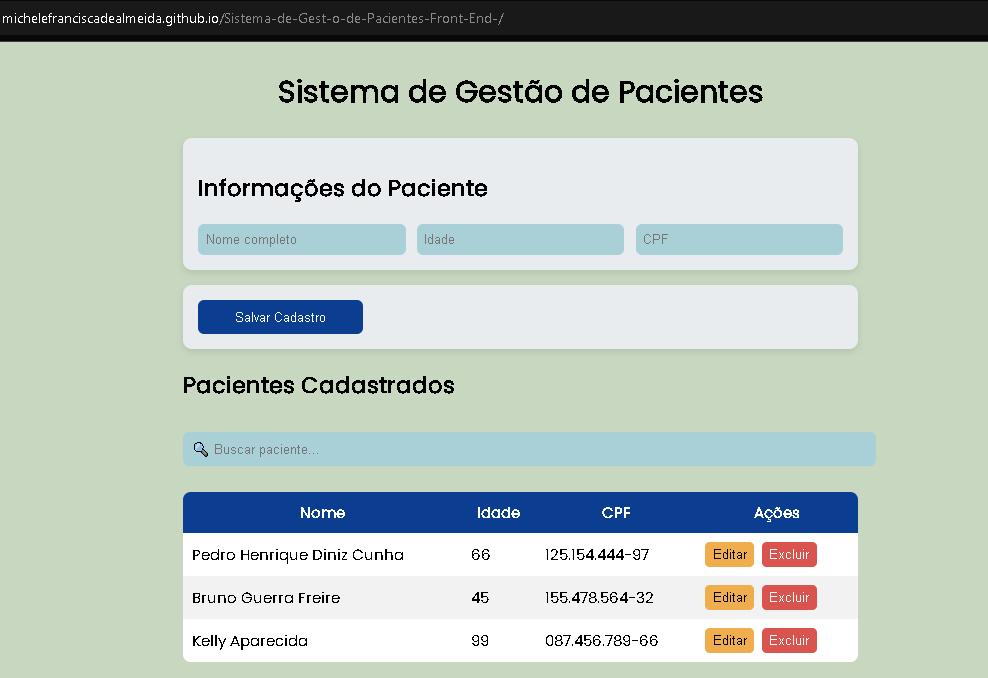

# 🏥 Sistema de Gestão de Pacientes

## 📌 Sobre o projeto
Este projeto foi desenvolvido com o objetivo de simular um sistema de cadastro e gerenciamento de pacientes, permitindo organizar informações de forma simples, clara e eficiente.

## 🎯 Objetivo
Praticar conceitos de desenvolvimento front-end, organização de dados e criação de interfaces voltadas para usabilidade.

## 🚀 Funcionalidades
- Cadastro de pacientes
- Exibição de informações
- Interface organizada e intuitiva
- Simulação de sistema real

## 🛠 Tecnologias utilizadas
- HTML
- CSS
- JavaScript

## 💡 Diferenciais
- Foco em experiência do usuário (UX)
- Interface limpa e responsiva
- Estrutura pensada para evolução futura (back-end/API)

## 📷 Demonstração

## 📚 Aprendizados
Durante o desenvolvimento, foram trabalhados:
- Estruturação de páginas web
- Organização de código
- Noções de UX/UI

## 🔗 Status do projeto
🚧 Em desenvolvimento / concluído (ajusta aqui)

---

Desenvolvido por Michele Almeida 💻